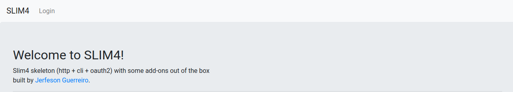

# Slim Framework 4 Skeleton Application (http + cli)

[](https://img.shields.io/github/v/release/jerfeson/slim4-skeleton)
[](LICENSE.md)
[](https://github.com/jerfeson/slim4-skeleton/actions)
[](https://img.shields.io/github/downloads/jerfeson/slim4-skeleton/total)



Use this skeleton application to quickly setup and start working on a new Slim Framework 4 application (Tested with slim 4.5). This application handles http and command line requests. This application ships with a few service providers and a Session middleware out of the box. Supports container resolution and auto-wiring.

To remove a service provider comment it on config/app.php file and remove it from composer.json, update composer.

Available service providers:

- [SlashTrace]
- [Monolog]
- [Eloquent]
- [Twig]
- [Flash Message]
- [Symfony Console]
- [FlySystem]
- [Redis Cache]
- [Codeception]
- [oAuth2]
- [Validation]
- [CSRF]

## Requirements

* PHP 7.2+ (with json extensions)
* MySQL 5.7+ or MariaDB
* Openssl
* Composer (only for development)

### Install the Application

Run this command from the directory in which you want to install your new Slim Framework application.

    php composer.phar create-project jerfeson/slim4-skeleton [my-app-name]

Replace `[my-app-name]` with the desired directory name for your new application. You'll want to:

* Point your virtual host document root to your new application's `public/` directory.
* Install the dependencies `composer install --prefer-dist --no-progress`.
* Ensure `storage/` is web writable.
* make the necessary changes in config file config/app.php

## Set permissions

    sudo chown -R yourusername:www-data storage/
    sudo chmod -R ug+w storage/

    chmod +x bin/console.php

## Database setup
Create a new database for development

    mysql -e 'CREATE DATABASE IF NOT EXISTS slim_skeleton'

Copy the file: config/env.example.php to config/development.php

    cp config/env.exemplo.php config/development.php

Change the connection configuration in config/development.php:
```php
<?php
$config = [
    'database' => [
        'default' => [
            'driver' => 'mysql',
            'host' => 'localhost',
            'database' => 'default',
            'username' => '',
            'password' => ''
        ]
    ]
];

return $config;
```


## Migrations

Use the command for create initial tables, used in oAuth2

    php bin/console.php migrations or composer console:migration

Go to the `data/keys/oauth` folder and create your project's public and private keys

#### Generating public and private keys

The public/private key pair is used to sign and verify JWTs transmitted. The Authorization Server possesses the private key to sign tokens and the Resource Server possesses the corresponding public key to verify the signatures. To generate the private key run this command on the terminal:

    openssl genrsa -out private.key 2048

If you want to provide a passphrase for your private key run this command instead:

     openssl genrsa -passout pass:_passphrase_ -out private.key 2048

then extract the public key from the private key:

    openssl rsa -in private.key -pubout -out public.key

or use your passphrase if provided on private key generation:

    openssl rsa -in private.key -passin pass:_passphrase_ -pubout -out public.key

The private key must be kept secret (i.e. out of the web-root of the authorization server). The authorization server also requires the public key.

If a passphrase has been used to generate private key it must be provided to the authorization server.

The public key should be distributed to any services (for example resource servers) that validate access tokens.

#### Generating encryption keys

Encryption keys are used to encrypt authorization and refresh codes. The AuthorizationServer accepts two kinds of encryption keys, a string password or a \Defuse\Crypto\Key object from the [Secure PHP Encryption Library].

##### string password

A `string` password can vary in strength depending on the password chosen. To turn it into a strong encryption key the [PBKDF2] key derivation function is used. This function derives an encryption key from a password and is slow by design. It uses a lot of CPU resources for a fraction of a second, applying key stretching to the password to reduce vulnerability to brute force attacks.

To generate a `string` password for the `AuthorizationServer`, you can run the following command in the terminal:

    php -r 'echo base64_encode(random_bytes(32)), PHP_EOL;'

Replace the value of OAuthServer::ENCRYPTION_KEY

##### Key object

A `\Defuse\Crypto\Key` is a strong encryption key. This removes the need to use a slow key derivation function, reducing encryption and decryption times compared to using a string password.

A `Key` can be generated with the `generate-defuse-key` script. To generate a `Key` for the `AuthorizationServer` run the following command in the terminal:

    vendor/bin/generate-defuse-key

Replace the value of OAuthServer::ENCRYPTION_KEY

The string can be loaded as a Key with Key::loadFromAsciiSafeString(self::ENCRYPTION_KEY).

### Run it:

1. `$ cd [my-app-name]\public`
2. `$ php -S localhost:8080`
3. Browse to http://localhost:8080

### Key directories

* `app`:        Application code (models, controllers, cli commands, handlers, middleware, service providers and others)
* `config`:     Configuration files like db, mail, routes...
* `lib`:        Other project classes like utils, business logic and framework extensions
* `resources`:  Views as well as your raw, un-compiled assets such as LESS, SASS, or JavaScript.
* `storage`:    Log files, cache files...
* `public`:     The public directory contains `index.php` file, assets such as images, JavaScript, and CSS
* `teste`:      The directory contains all tests using in codeception
* `vendor`:     Composer dependencies

### Console usage

* Usage: php public/index.php [command-name]
* List: php public/index.php list For list all commands
How to create a new command:
 1. Create a class under directory console\ in namespace Console\
 2. Your class should extend Symfony\Component\Console\Command\Command
 4. DONE!

Example:

Command class:
```php
<?php

namespace Console;

use Symfony\Component\Console\Command\Command;
use Symfony\Component\Console\Input\InputInterface;
use Symfony\Component\Console\Output\OutputInterface;

/**
 * Class DatabaseCommand
 *
 * @package Console\Migration
 */
class SampleCommand extends Console
{

    protected function configure()
    {
        $this->setName("app:sample");
        $this->setDescription("Sample command console");
    }

    protected function execute(InputInterface $input, OutputInterface $output): int
    {
        $message = "<info>Hello, I'm console</info>";
        $output->writeln($message);
        return Command::SUCCESS;
    }
}
```

Execute the class:method from command line:

```shell
php public/index.php app:sample
```

### Code examples

Get application instance
```php
$app = \Lib\Framework\App::instance();
// or simpler using a helper function
$app = app();
```

### Codeception test examples

Have the version 79 of chrome installed. otherwise, [download] your version driver

go to the test folder and run the following command. (Windows)
```
tests/_drivers/chromedriver.exe --url-base=/wd/hub
```
go to the test folder and run the following command. (linux)
```
./tests/_drivers/chromedriver --url-base=/wd/hub
```
go to project folder and run the following command.

```
./vendor/bin/codecept run --steps
```
or
```
php vendor/bin/codecept run --steps
```

## Roadmap

 - [ ] more service providers
 - [ ] more code examples

## Contributing

 - welcome to discuss a bugs, features and ideas.

## License

jerfeson/slim4-skeleton  is release under the MIT license.

## Thanks

This project is based on the project in [jupitern/slim3-skeleton] feel free to contribute to this and the other project.

- [jupitern]

[jupitern]: https://github.com/jupitern
[jupitern/slim3-skeleton]: https://github.com/jupitern/slim3-skeleton

[Symfony Console]:https://symfony.com/doc/current/index.html
[SlashTrace]:https://github.com/slashtrace/slashtrace
[Monolog]:https://github.com/Seldaek/monolog
[Eloquent]:https://github.com/illuminate/database
[Twig]:https://github.com/twigphp/Twig
[Flash Message]:https://github.com/slimphp/Slim-Flash
[Codeception]:https://codeception.com
[download]:https://sites.google.com/a/chromium.org/chromedriver/downloads
[oAuth2]:https://oauth2.thephpleague.com/
[Eloquent]:https://github.com/illuminate/database
[FlySystem]:https://github.com/thephpleague/flysystem
[Redis Cache]:https://github.com/naroga/redis-cache
[Secure PHP Encryption Library]:https://github.com/defuse/php-encryption
[PBKDF2]:https://github.com/defuse/php-encryption
[Validation]:https://github.com/jerfeson/slim-validation
[CSRF]:https://github.com/slimphp/Slim-Csrf
